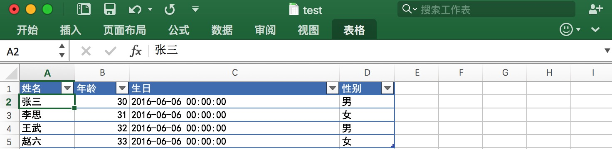

# About excel serializer for java
Automatic conversion between Excel data and T

自动映射Excel列与实体类,简化从Excel读取数据到实体对象.(本项目基于jxl操作Excel,相关包请先行引用)

# 例子
## Excel文件数据

## Main函数
```java
public static void main(String[] args) {
  try {
    String uri = "test.xls";//需要读取的xls文件,暂不支持xlsx文件
    ExcelSerializer<Person> helper = new ExcelSerializer<Person>(Person.class);
    List<Person> a = helper.load(uri);
    System.out.println(a.size());
  } catch (Exception e) {
    e.printStackTrace();
  }
}
```
## 实体类
```java
import java.util.Date;

import net.leonhoo.tools.excel.serializer.AgeColorPicker;
import net.leonhoo.tools.excel.serializer.DateConverter;
import net.leonhoo.tools.excel.serializer.GenderConverter;
import net.leonhoo.tools.excel.serializer.annotation.Color;
import net.leonhoo.tools.excel.serializer.annotation.Index;
import net.leonhoo.tools.excel.serializer.annotation.Display;
import net.leonhoo.tools.excel.serializer.annotation.Converter;

@Display("个人信息")
public class Person {

	@Display("姓名")
	@Index(0)
	private String name;

	@Display("年龄")
	@Index(1)
	@Color(AgeColorPicker.class)
	private int age;

	@Display("生日")
	@Index(2)
	@Converter(DateConverter.class)
	private Date birthday;

	@Display("性别")
	@Index(3)
	@Converter(GenderConverter.class)
	private boolean isMale;

	public String getName() {
		return name;
	}

	public void setName(String name) {
		this.name = name;
	}

	public int getAge() {
		return age;
	}

	public void setAge(int age) {
		this.age = age;
	}

	public Date getBirthday() {
		return birthday;
	}

	public void setBirthday(Date birthday) {
		this.birthday = birthday;
	}

	public boolean isMale() {
		return isMale;
	}

	public void setMale(boolean isMale) {
		this.isMale = isMale;
	}

	public boolean getIsMale() {
		return isMale;
	}

	public void setIsMale(boolean isMale) {
		this.isMale = isMale;
	}
}
```
## 时间值转换类
```java
import java.lang.reflect.Type;
import java.text.SimpleDateFormat;
import java.util.Date;

import net.leonhoo.tools.excel.serializer.adapter.IValueConverter;

public class DateConverter implements IValueConverter {

	@Override
	public Object serialize(Object value, Type targetType, Object parameter) throws Exception {
		if (value != null) {
			Date v = (Date) value;
			//具体时间格式请自行定义
			SimpleDateFormat sdf = new SimpleDateFormat("yyyy-MM-dd HH:mm:ss");
			return sdf.format(v);
		}
		return null;
	}

	@Override
	public Object deserialize(Object value, Type targetType, Object parameter) throws Exception {
		if (value != null) {
			String v = value + "";
			//具体时间格式请自行定义
			SimpleDateFormat sdf = new SimpleDateFormat("yyyy-MM-dd HH:mm:ss");
			return sdf.parse(v);
		}
		return null;
	}
}
```
## 单元格颜色配置类
```java
import java.lang.reflect.Type;

import net.leonhoo.tools.excel.serializer.adapter.IColorPicker;

public class AgeColorPicker implements IColorPicker {

	@Override
	public String get(Object value, Type targetType, Object parameter) throws Exception {
		if (value != null) {
			int age = (int) value;
			if (age > 10) {
				return "#FF00FF";
			}
		}
		return null;
	}

}
```
## 性别值转换类
```java
import java.lang.reflect.Type;

import net.leonhoo.tools.excel.serializer.adapter.IValueConverter;

public class GenderConverter implements IValueConverter {

	@Override
	public Object serialize(Object value, Type targetType, Object parameter) throws Exception {
		if (value != null) {
			Boolean v = (boolean) value;
			return v ? "男" : "女";
		}
		return null;
	}

	@Override
	public Object deserialize(Object value, Type targetType, Object parameter) throws Exception {
		if (value != null) {
			return value.equals("男");
		}
		return null;
	}
}
```